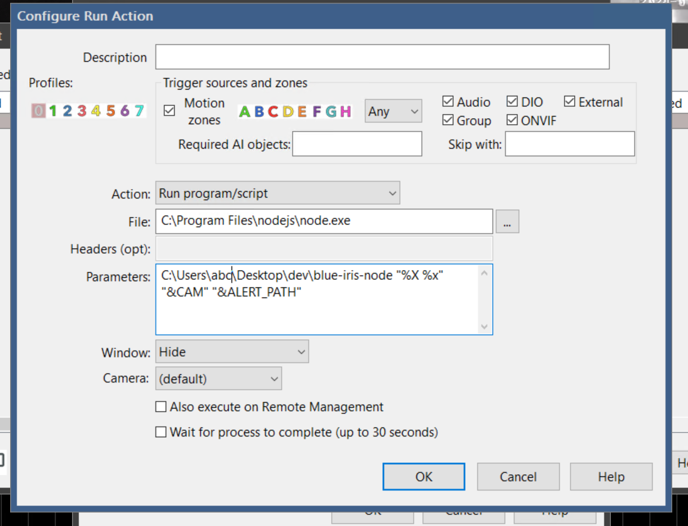

NodeJS to send an email alert via PushOver on BlueIris trigger

Add a Alert to camera selecting "Run progrm/script"

The file should be your `node.exe`, in my case `C:\Program Files\nodejs\node.exe`.

The parameters should be the location of this repository (the index.js) followed by the three expected parameters of the script.

1. time
2. camera name
3. The place where JPG are saved (I think)

Example: `C:\Users\abc\Desktop\dev\blue-iris-node "%X %x" "&CAM" "&ALERT_PATH"`

Screen shot:



Rename `.env.copy` to `.env` and replace the variables

```
PUSHOVER_USER=
PUSHOVER_TOKEN=
ALERT_DIR="C:\BlueIris\Alerts"
```
